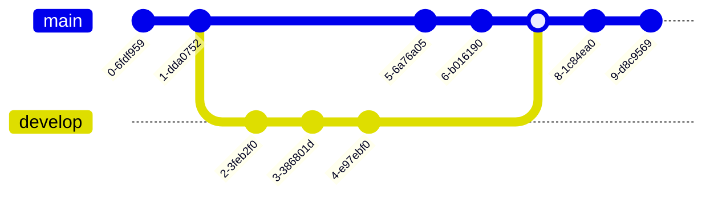

# 标题


[题目来源](https://fullstack-challenges.netlify.app/)

## 题目要求和代码
```vue

```

## 解答

```vue


- xx
+ aa
```

## 视频

[]()

https://mermaid.js.org/syntax/examples.html


default, neutral,dark,forest,base





